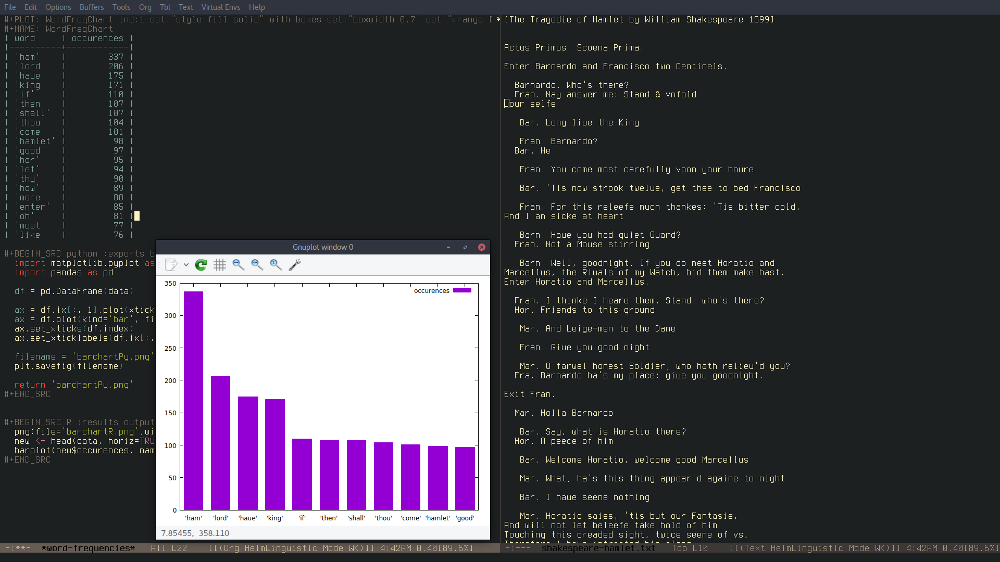

# Table of Contents

1.  [Introduction](#org0fed4e4)
2.  [How to install](#orga6106ca)
3.  [How to use](#org0d666de)
    1.  [Collocation](#orgf47645c)
    2.  [Ngrams](#org1be4169)
    3.  [Word Frequency](#org15e249f)
    4.  [Ngram Frequency](#org0e99341)
    5.  [Custom variables](#orgc3011e0)
4.  [Examples](#org0942831)
    1.  [Integration with eww](#org8c782c7)
    2.  [With large .txt files](#orgd8eafc1)
5.  [](#orge319ec9)


<a id="org0fed4e4"></a>

# Introduction

Linguistic mode allows to perform basic linguistic analysis on a buffer's contents. It is possible to do collocation searches and obtain word or ngram frequencies.

It was designed in order to introduce linguistics students and linguistics enthusiasts to the field corpus analysis. Therefore, it is quite ideal for simple analyses on small files.


<a id="orga6106ca"></a>

# How to install

You can install linguistic-mode from MELPA with `M-x package-list-packages` after you have added the MELPA repository to your *.emacs* file with the following:

```elisp
    (add-to-list 'package-archives
                 '("melpa" . "http://melpa.org/packages/"))
```

You can also use `M-x package-build-create-recipe` and use the following:

    (linguistic :fetcher github 
    	    :repo "andcarnivorous/linguistic-mode" 
    	    :files ("*.el" "*.org"))

If you want to install with **git clone** you will have to tweak the functions `linguistic-gram-freq` and `linguistic-word-freq` in order for them to find the **graph.org** file.


<a id="org0d666de"></a>

# How to use

The main interactive functions are 4:

-   `linguistic-collocation`
-   `linguistic-ngrams` &emsp;&emsp;&emsp;&emsp;(**C-c C-g**)
-   `linguistic-word-freq` &emsp;&emsp; (**C-c C-w**)
-   `linguistic-grams-freq` &emsp;&emsp; (**C-c C-n**)

If you activate the minor mode with `M-x linguistic-mode` these functions will be available with their respective keybindings.


<a id="orgf47645c"></a>

## Collocation

This function allows you to find every instance of a word in the buffer and its surrounding context. The size of the context (how many words on the left and right will be displayed) is chosen by the user.

After calling `linguistic-collocation` you will be asked to insert the number of words after the keyword, before the keyword and finally the keyword itself. Remember that the keyword should always be lowercase.

Once the function has analyzed the whole buffer it will return in a new buffer the list of all the occurrences of the selected keyword.

If you use 0 as number for your context before and/or after the keyword the word "nil" will show up instead of any context.

Remember that the more words on the sides, the more it will take to analyze the buffer. The function also substitutes any punctuation with a period.


<a id="org1be4169"></a>

## Ngrams

This function will return a list, in a new buffer, of all the ngrams present in the buffer and the number of ngrams resulted.

When you call `linguistic-ngrams` you will have to insert the size of the ngram first. 


<a id="org15e249f"></a>

## Word Frequency

This function will return, in a new buffer, an org-table with the N most frequent words in the buffer or selected area  and their occurrences. The new buffer will also contain some code snippets in Python, Gnuplot and R that will allow you to get a bar chart of the result.

When you call `linguistic-word-freq` you will be asked how long you want the result list (the table, basically) to be. If you choose a number that is higher than the number of single words in the result, the function will return an error.

You will also be asked if you want to include stopwords or not. Stopwords are words that usually are not really relevant to word-frequency analysis (e.g. "and", "I", "what", "could", etc&#x2026;).




<a id="org0e99341"></a>

## Ngram Frequency

This function works just like `linguistic-word-freq` and can be applied to the whole buffer or a selected area. The only difference is that you will also be prompted to insert the size of the ngram you want in your result (2 for bigrams, 3 for trigrams and so on).


<a id="orgc3011e0"></a>

## Custom variables

There are 2 custom variable that you can customize with `M-x customize-group linguistic-analysis`:

-   `linguistic-splitter` contains the regex that regulate which special characters will be included in ngrams, word-freq and grams-freq.

-   `linguistic-stopwords` contains a list of words that will not be included in word-freq if the uses chooses to apply the stopwords filter.


<a id="org0942831"></a>

# Examples


<a id="org8c782c7"></a>

## Integration with eww

A nice way to use linguistic-mode is to implement it when browsing with eww.
Instead of copy-pasting the contents of a tabloid article in a new txt file or stripping the html in other programming languages, it is possible to have preliminary results immediately, which can be quite handy to people just starting out with corpus linguistics.


<a id="orgd8eafc1"></a>

## With large .txt files

When you use linguistic-mode on big files the waiting time for results can be long.

Using `linguistic-collocation`, with an i5, it took this machine 61 seconds to find all the occurrences of the word "emma", with 3 context words on each side, in the novel "Emma" by Austen.
Instead it took 33 seconds to find the same word with just 1 context word per side.

Using `linguistic-grams-freq` to get the most frequent trigrams in the novel took 160 seconds.


<a id="orge319ec9"></a>

# TODO 

-   [X] Preview word-freq and gram-freq list length before prompt.
-   [ ] Affixes in collocation
-   [ ] Snowball Stemmer

